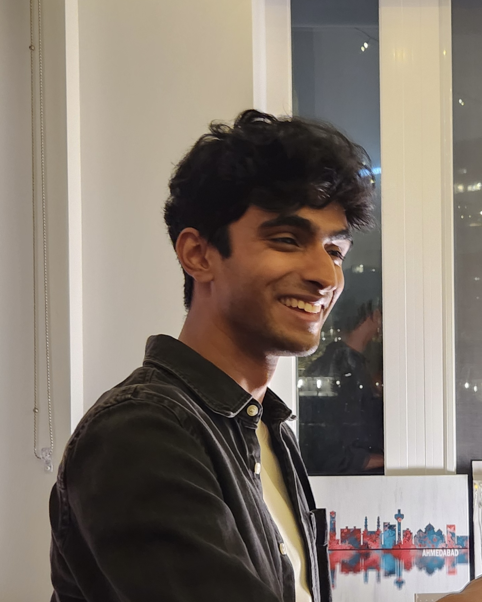

Hi! I'm Achu. I'm an AI Safety researcher and engineer, focusing on building robust model evaluations and interpretability frameworks.

I'm currently focused on improving our understanding of evaluation awareness in frontier models with Santiago Aranguri. Before that, I worked on agentic evaluation projects centered around exploration hacking and goal drift. I've had fairly diverse career experiences in the past few years - before getting into AI, I worked as a Data Scientist at Jerry, and prior to that I majored in Molecular Engineering at the University of Chicago after initially intending to pursue Biology.

Outside of research, I enjoy thinking about, watching, and playing football. I love reading (audiobooks) and I like to sing whenever the opportunity arises (in a past life I was [really into a cappella](https://www.youtube.com/watch?v=4TtJtPbmRzk&pp=ygUTYmV0dGVyIHJhbnNvbSBub3Rlcw%3D%3D)).

Feel free to reach out if you'd like to chat :) 

[Email](mailto:achyutha11@gmail.com) &bull; [GitHub](https://github.com/achyutha11) &bull; [LinkedIn](https://linkedin.com/in/achu-menon/)

